# Web UI — Brand & color scheme

The explorer uses **Muted Violet** on a calm dark/light shell. Tokens live in
[`src/app.css`](./src/app.css). Banner, favicon, and sidebar logo must stay in
sync with these values.

## Simulation mode (no backend)

For UI and screenshot testing without a running opencode-mem server on `:4747`:

```bash
bun run dev:sim
```

This sets `OPENCODE_MEM_SIM=1` and serves `/api/*` from fixtures in [`sim/`](./sim/)
via a Vite middleware (see [`vite-plugins/opencode-mem-sim.ts`](./vite-plugins/opencode-mem-sim.ts)).
Normal `bun run dev` still proxies to `:4747`.

Covered: health, tags, stats, memories (paginated + tag filter), search, user
profile, changelog, migration detect (no-op), AI cleanup preview. Mutating
`POST`/`PUT`/`DELETE` calls return stub success so toast paths stay testable —
nothing is persisted.

GitHub Markdown cannot paint CSS, but it **can** show colors via small SVG
swatches (see [`docs/swatches/`](./docs/swatches/)).

## Accent

| Role                                        | Dark                                       | Light                                      |
| ------------------------------------------- | ------------------------------------------ | ------------------------------------------ |
| Primary (buttons, links, Brain icon, ring)  |  `#c4b5fd` |  `#7c3aed` |
| On-primary text                             |  `#2e1065` | 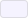 `#f5f3ff` |
| Accent well (`ICON_WELL` / `bg-primary/15`) | primary at 15% opacity                     | 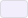 `#f3eefc` |
| Accent surface (sidebar active bg)          |  `#1a1428` | 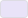 `#e9e3f8` |

Dark primary `#c4b5fd` is also the favicon stroke and banner accent.

## Shell

| Token             | Dark                                       | Light                                      |
| ----------------- | ------------------------------------------ | ------------------------------------------ |
| Background        | 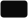 `#0a0a0a` | 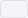 `#f5f4f8` |
| Card / elevated   | 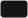 `#141414` | 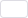 `#ffffff` |
| Sidebar / panel   | 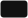 `#111111` | 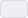 `#f0eef5` |
| Border / input    |  `#2a2a2a` | 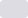 `#dddce3` |
| Foreground        |  `#d4d4d4` | 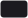 `#1b1a1f` |
| Foreground bright |  `#ffffff` |  `#0a0a0a` |
| Muted text        |  `#8a8a8a` |  `#6b6874` |

## Logo recipe

Same mark everywhere (Lucide **Brain**):

1. Rounded square (`rounded-xl`)
2. Fill = surface + **primary at 15%** (`ICON_WELL` = `bg-primary/15 text-primary`)
3. Icon stroke/color = **primary**

- Sidebar: `ICON_WELL` in [`src/lib/ui/styles.ts`](./src/lib/ui/styles.ts)
- Favicon: [`public/favicon.svg`](./public/favicon.svg) (icon only, no well)
- Banner: [`scripts/render-banner.mjs`](./scripts/render-banner.mjs) uses the same primary/15 well

## Typography

UI chrome uses **JetBrains Mono** (`--font-mono` in `app.css`).

## Preview & regenerate

- Live accent playground: run the Vite app and open `/accent-preview.html`
- Regenerate GitHub banner (needs JetBrains Mono TTFs under `/tmp/jetbrains-mono/fonts/ttf/`):

```bash
cd web && bun scripts/render-banner.mjs
```

Writes [`.github/pics/banner.png`](../.github/pics/banner.png).
